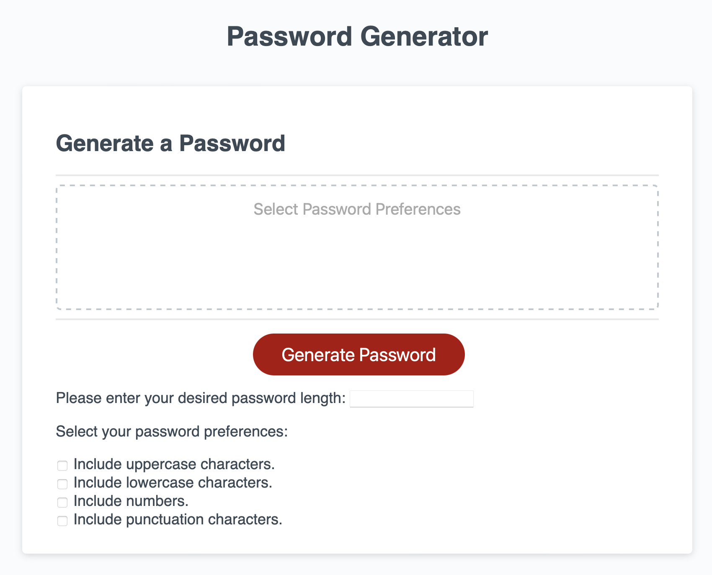

# password-generator
This repository will hold an application that an employee can use to generate a random password based on criteria they’ve selected by modifying starter code, which will run in the browser and will feature dynamically updated HTML and CSS powered by JavaScript code.

Here is the link to the deployed application: https://swu664.github.io/password-generator/